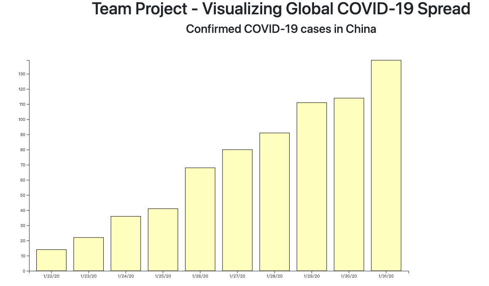

# Work in Progress

## Briefly describe the features that are finished and the features that need to be completed.
- We have performed initial processing on the csv data, standardizing the structure and data types.
- We have modularized the charts we have previously learned, allowing us to call a function to draw the corresponding chart in this project, such as barchart.
- We will continue to organize all the charts required for this project into functions, placing each chart's drawing and updating functions in their respective JavaScript files, which can be referenced when needed.
- We will complete the interactive functionality of the charts.

## Briefly talk about any changes in the project since the proposal. Such as, have any designs or interactions changed?
None

## Add at least 1 screenshot documenting your current prototype running. This screenshot should include all the visualizations implemented so far (you can use multiple screenshots if necessary).

## Add a link to the original data source, and if the data was pre-processed, describe what you did.
Here is the original data source: [Data Source](https://github.com/CSSEGISandData/COVID-19/blob/master/csse_covid_19_data/)

The github team-project repository: [Github Repository](https://github.com/TopKingHao/team-project-478)
