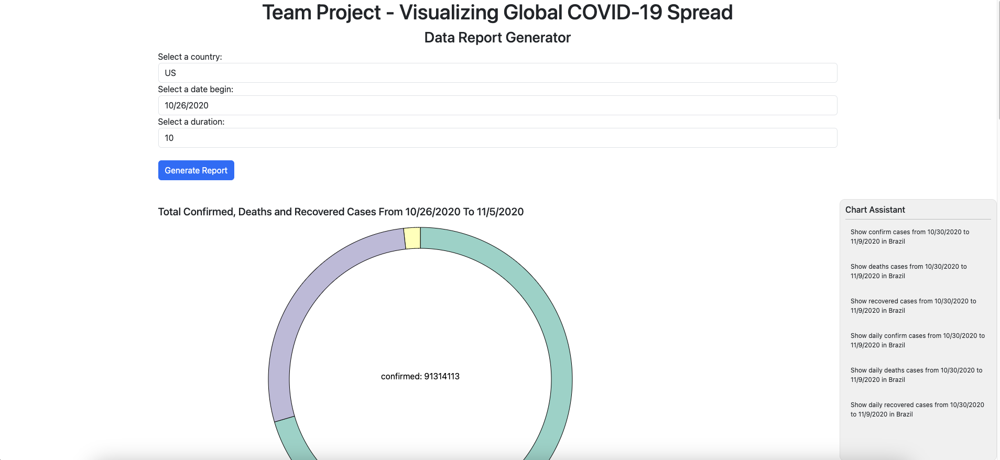
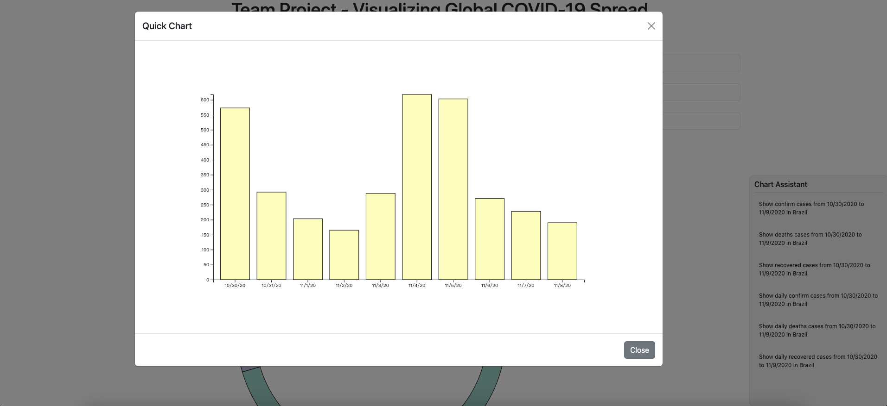
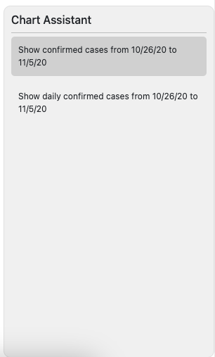
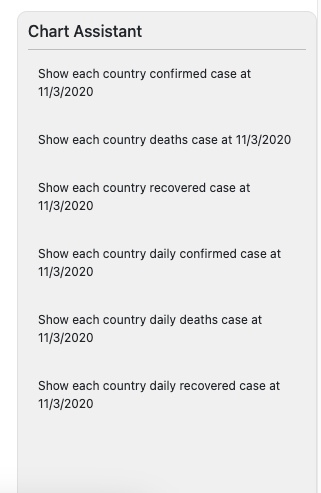

# Writeup
## Title: Visualizing Global COVID-19 Spread

## Team Members:
 - Member 1: Hao Zhen, 1215712108, hzhen3@asu.edu
 - Member 2: Akki Kishore, 1221618099, akishor3@asu.edu
 - Member 3: Valliappan

## Overview:
This project is used to display COVID-19 related charts. Users can choose the country, start date, and end date to view. The project can generate chart reports based on these parameters.
The pictures of this project provide rich data interaction functions. When the mouse is hovered over the chart, detailed data information can be displayed. When the user clicks on the chart, relevant suggestions can be displayed in the chart assistant in the lower right corner. Each suggestion can display the chart related to the suggestion.

## Data description
The main dataset will be the COVID-19 dataset from Our World in Data, which contains daily time-series data on confirmed cases, deaths, and tests for different countries. Additional data on government responses and mobility may be incorporated to show their impact. The data will be preprocessed for analysis and visualization.

The original data is csv format, for the use of convenience, we do the following process:
1. Convert data of each field to appropriate data types (i.e. integer for all confirm, deaths and recovered cases)
2. Group the data by country, sum all the cases of the regions in each country
3. Combine three data sources into one dict

Here is the original data source: [Data Source](https://github.com/CSSEGISandData/COVID-19/blob/master/csse_covid_19_data/)

## Goals and Tasks

### Goal
- Allow use to query the interesting date duration and country
- Show summary chart of the data in that duration
- Show detail chart of the data in that duration
- Show bubble chart of all countries

### Task
- [x] Data processing
- [x] Data query library
- [x] Bar chart library
- [x] Pie chart library
- [x] Lollipop chart library
- [x] Bubble chart library
- [x] Tooltip library
- [x] Combobox builders
- [x] Utils functions
- [x] Chart Advices Manager
- [x] Html Framework
- [x] Data Presentation
- [x] Data Interaction

## Idioms

The interface first allows users to select data query conditions, including starting date, ending date and country.
When the user completes the selection, click the Generate button to generate the chart report.

The report first displays the overall confirmed cases, death cases and recovered cases for the selected country during the time period. The data is displayed using pie chart, because the proportional relationship between the three needs to be displayed, and the pie chart is the most intuitive.

Then the cumulative number of deaths in the country during this period is displayed. This section uses barchart, which can intuitively display the trend of the data and the differences in the data every day.

Then it shows the country’s accumulated confirmed, deaths and recovered cases, using the Lollipop chart. It can display multiple sets of data at the same time.

Finally, a bubble chart is used to show the relationship between confirm cases and deaths cases in different countries, where the x-axis is used to represent confirmation cases and the radius is used to represent death cases in that country.

This project provides a data interaction function, which not only includes the most basic tooltips, but also allows users to complete the interaction between data by clicking the mouse. It provides a chart assistant function in the lower right corner of the interface. When the user clicks on a certain part of the chart, it will display relevant suggestions. For example, if the user selects the confirmed cases part of the pie chart, the chart assistant will display two suggestions:

- Show confirmed cases from xxx to xxx
- Show daily confirmed cases from xxx to xxx

Different charts will have different advice. When the user clicks on an advice, a quick chart window will pop up. In the window, the project will draw a chart according to the advice selected by the user.

Here is some screenshot of the chart assistant:

We use a diff algorithm to compare the data before and after, then the chart would use the diff result to do animation.

## Reflection
Describe how your project developed from an initial proposal to WIP to final product.

We first sorted out the needs, and then formulated the initial development framework, that is, making all charts into independent modules. Then after testing that it works, the task is assigned.

Did the goals change?
- Add bubble chart
- Add chart assistant

How realistic was the original proposal?

Most of the original proposal has been implemented in the final project.

Were there any unexpected challenges that arose? Were there features you wanted to implement that you ultimately did not? What workarounds did you do?

No

What would you do differently next time?

Might consider some more creative diagrams.

## Team workload
- [x] Project Framework: Hao Zhen, Akki Kishore
- [x] Data processing: Hao Zhen, Akki Kishore
- [x] Data query library: Akki Kishore, Valliappan
- [x] Bar chart library: Hao Zhen, Akki Kishore
- [x] Pie chart library: Hao Zhen, Akki Kishore
- [x] Lollipop chart library: Hao Zhen, Valliappan
- [x] Bubble chart library: Hao Zhen, Valliappan
- [x] Tooltip library: Hao Zhen, Akki Kishore
- [x] Combobox builders: Akki Kishore, Valliappan
- [x] Utils functions: Akki Kishore, Valliappan
- [x] Chart Advices Manager: Hao Zhen, Valliappan
- [x] Html Framework: Akki Kishore, Valliappan
- [x] Data Presentation: Hao Zhen, Valliappan
- [x] Data Interaction: Hao Zhen, Valliappan, Akki Kishore

